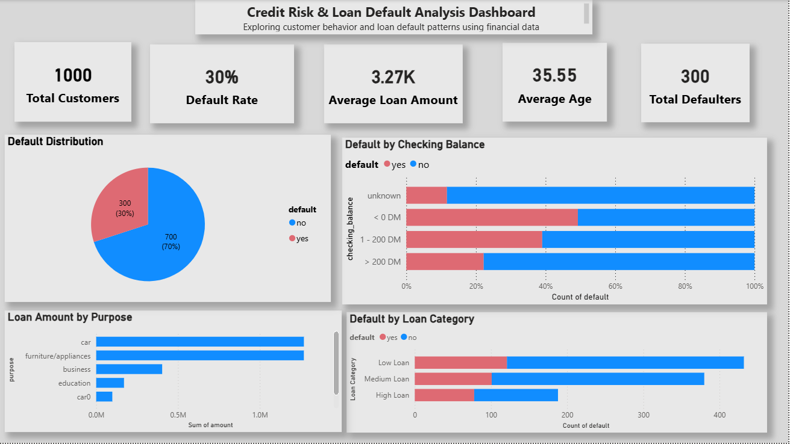
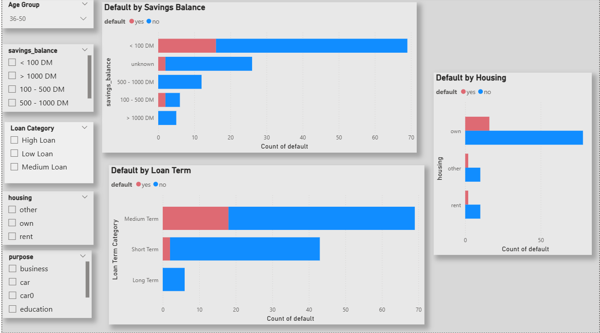

# 📊 Credit Risk & Loan Default Analysis Dashboard

## 📌 Project Overview

This project presents an interactive **Power BI dashboard** designed to analyze customer loan data and identify patterns related to **loan defaults and credit risk**.

The dashboard helps in understanding customer behavior, financial profiles, and risk segmentation to support better decision-making in lending.

---

## 🎯 Objectives

* Analyze loan default distribution
* Identify key factors influencing customer defaults
* Segment customers based on financial attributes
* Provide insights for risk-based decision-making

---

## 📁 Dataset

* **Source:** Bank Loan Dataset
* **File:** `credit.csv`
* Contains customer-level financial and demographic data such as:

  * Age
  * Loan Amount
  * Checking Balance
  * Savings Balance
  * Loan Purpose
  * Loan Category
  * Default Status

---

## 📊 Dashboard Features

### 🔹 Page 1 — Overview Analysis

* Default Distribution (Pie Chart)
* Loan Amount by Purpose
* Default by Checking Balance
* Default by Loan Category
* KPI Cards:

  * Total Customers
  * Average Age
  * Average Loan Amount
  * Total Defaulters
  * Default Rate

---

### 🔹 Page 2 — Risk Analysis

* Default by Age Group
* Default by Savings Balance
* Default by Loan Term
* Default by Housing

---

### 🎛️ Interactive Filters (Slicers)

* Purpose
* Checking Balance
* Savings Balance
* Housing
* Age Group
* Loan Category
* Loan Term Category

These filters allow dynamic exploration of risk patterns.

---

## 🛠 Tools & Technologies

* **Power BI** → Dashboard creation
* **Data Modeling** → Relationships & transformations
* **Data Visualization** → Business insights

---

## 📈 Key Insights

* Customers with lower balances show higher default rates
* Loan category impacts repayment behavior significantly
* Certain age groups show higher financial risk
* Loan purpose influences loan amount and default trends

---

## 📷 Screenshots

### Dashboard Overview

### Risk Analysis

---

## 🚀 How to Use

1. Download the `.pbit` file
2. Open in Power BI Desktop
3. Load the dataset (`credit.csv`) when prompted
4. Interact with filters and visuals

---

## 💡 Use Case

This dashboard can be used by:

* Banks & Financial Institutions
* Risk Analysts
* Data Analysts
* Business Intelligence Teams

To monitor loan performance and improve credit risk strategies.

---

## 👩‍💻 Author

**Moulya Eraiahswamy**
📍 France
🔗 GitHub: https://github.com/Moulyaamrutha

---

## ⭐ If you like this project

Give it a ⭐ on GitHub!
